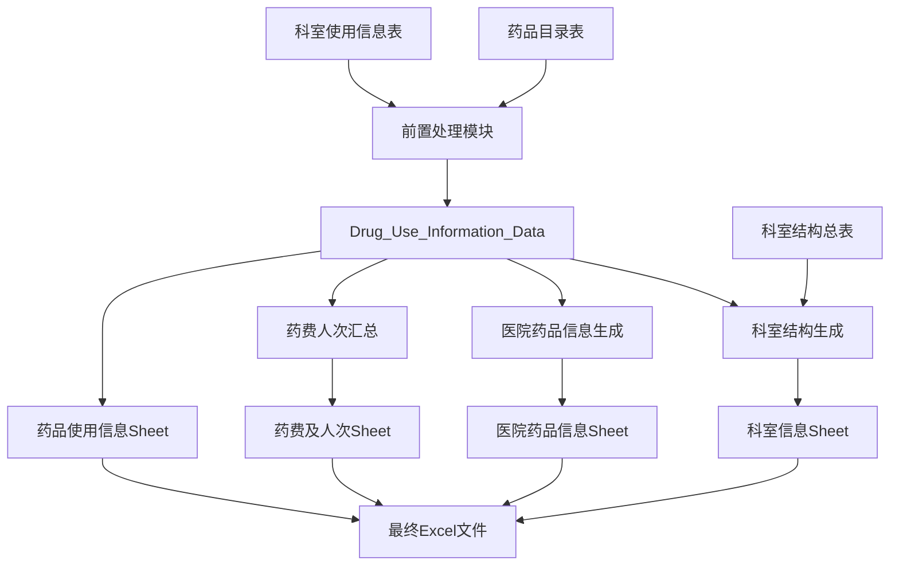

# 东软-王琳版本医疗数据处理工具说明文档

## 版本信息
- **版本名称**: 东软-王琳版本
- **版本号**: v3.0
- **发布日期**: 2025年1月
- **适用平台**: Windows 10/11
- **Python版本**: 3.8+

## 目录

1. [版本概述](#版本概述)
2. [核心特性](#核心特性)
3. [系统架构](#系统架构)
4. [输入数据要求](#输入数据要求)
5. [数据处理流程](#数据处理流程)
6. [输出结果说明](#输出结果说明)
7. [版本配置](#版本配置)
8. [GUI使用指南](#gui使用指南)
9. [技术文档](#技术文档)
10. [常见问题](#常见问题)
11. [版本历史](#版本历史)
12. [附录](#附录)

---

## 版本概述

东软-王琳版本是医疗数据处理工具的最新版本，专为医院药品使用数据的标准化处理而设计。本版本在数据处理能力、用户体验和系统稳定性方面都有显著提升。

### 主要改进

- **双文件输入模式**: 支持药品目录表和科室使用信息表的分离输入
- **四级科室结构**: 完整支持一级→二级→三级→四级的科室层级体系
- **四个输出工作表**: 生成医院药品信息、药品使用信息、科室信息、药费及人次四个标准化表格
- **智能数据处理**: 采用先进的数据聚合和科室识别算法
- **版本配置支持**: 支持通平台1.4和1.5版本的差异化配置

### 核心价值

1. **数据标准化**: 将不同格式的原始数据转换为标准化的医疗数据格式
2. **科室管理**: 智能识别和管理复杂的医院科室结构
3. **自动化处理**: 减少人工干预，提高数据处理效率和准确性
4. **兼容性强**: 支持多种数据格式和版本配置
---

##
 核心特性

### 1. 双文件输入模式

东软-王琳版本支持两种输入模式：

#### 主要模式：双文件输入
- **药品目录表**: 包含药品基础信息的Excel文件
- **科室使用信息表**: 包含科室药品使用记录的Excel文件

#### 兼容模式：单文件输入
- 兼容早期版本的单一药品使用信息文件

### 2. 智能数据聚合

采用基于data_pro.py的先进聚合算法：
- 按科室和药品自动分组聚合
- 智能去重和数据清洗
- 保证数据完整性和一致性

### 3. 四级科室结构支持

#### 科室层级体系
```
一级结构: 全院合计
├── 二级结构: 科室大类（如：内科、外科）
    ├── 三级结构: 具体科室（如：心内科、普外科）
        └── 四级结构: 科室子单元（如：心内科一病房、普外科A组）
```

#### 智能科室识别
- 支持多种科室命名规范
- 自动识别四级结构科室
- 智能分类门诊和住院科室

### 4. 四个标准化输出工作表

1. **医院药品信息**: 药品基础信息表
2. **药品使用信息**: 详细的药品使用记录
3. **科室信息**: 完整的科室层级结构（支持单元格合并）
4. **药费及人次**: 按科室汇总的费用和人次统计

### 5. 版本配置支持

- **通平台1.4版本**: 使用"规格转换系数"列名
- **通平台1.5版本**: 使用"规格转换系数（非包装转换比）"列名
- 一键切换，自动适配不同版本要求

### 6. 科室结构总表自动维护

- 自动保存到桌面：`科室结构总表.xlsx`
- 新增科室自动添加和高亮显示
- ID格式自动修正，确保数据一致性
- 支持手动编辑和自定义科室结构---

## 
系统架构

### 整体架构图

```
┌─────────────────────────────────────────────────────────────┐
│                    东软-王琳版本架构                          │
├─────────────────────────────────────────────────────────────┤
│  用户界面层 (medical_data_processor_gui.py)                 │
│  ├── 文件选择界面 (药品目录 + 科室使用信息)                   │
│  ├── 版本配置界面 (通平台1.4/1.5选择)                       │
│  ├── 时间设置界面 (年月格式输入)                             │
│  └── 处理进度界面 (实时日志显示)                             │
├─────────────────────────────────────────────────────────────┤
│  核心处理层 (complete_medical_data_processor.py)            │
│  ├── 前置处理模块 (基于data_pro.py逻辑)                     │
│  ├── 科室结构管理模块 (四级结构识别与维护)                   │
│  ├── 数据聚合模块 (按科室汇总统计)                           │
│  └── Excel生成模块 (四个工作表生成)                         │
├─────────────────────────────────────────────────────────────┤
│  数据存储层                                                 │
│  ├── 输入数据: 药品目录表 + 科室使用信息表                   │
│  ├── 中间数据: Drug_Use_Information_Data.xlsx              │
│  ├── 配置数据: 科室结构总表.xlsx (桌面自动维护)              │
│  └── 输出数据: 目标表格_时间戳.xlsx (四个工作表)             │
└─────────────────────────────────────────────────────────────┘
```

### 核心模块说明

#### 1. 前置处理模块
- **功能**: 将药品目录和科室使用信息合并生成标准化数据
- **算法**: 基于data_pro.py的分组聚合逻辑
- **输出**: Drug_Use_Information_Data.xlsx

#### 2. 科室结构管理模块
- **功能**: 维护四级科室结构和ID一致性
- **特性**: 智能识别、自动分类、ID格式修正
- **维护**: 桌面科室结构总表自动更新

#### 3. 数据聚合模块
- **功能**: 按科室汇总药费和统计数据
- **计算**: 基于Drug_Use_Information_Data进行聚合
- **输出**: 药费及人次汇总数据

#### 4. Excel生成模块
- **功能**: 生成四个标准化工作表
- **特性**: 支持版本配置、样式设置、单元格合并
- **格式**: 专业的医疗数据报表格式-
--

## 输入数据要求

### 必需文件

#### 1. 药品目录表 (Excel格式)

**必需列及要求**:

| 列名 | 数据类型 | 说明 | 示例 |
|------|----------|------|------|
| 编码 | 字符串 | 药品唯一标识，用于与科室使用信息匹配 | "A001", "B002" |
| 药品名称 | 字符串 | 药品的完整名称 | "阿司匹林肠溶片" |
| 规格 | 字符串 | 药品规格描述 | "100mg*30片" |
| 零售价 | 数值 | 药品零售价格(元) | 15.50 |
| 生产厂家 | 字符串 | 药品生产厂家信息 | "拜耳医药有限公司" |
| 购入价 | 数值 | 医院购入价格(元) | 12.80 |
| 医保编码 | 字符串 | 国家医保编码 | "XJ01CR02" |

**数据格式要求**:
- 文件格式：Excel (.xlsx 或 .xls)
- 编码列不能有重复值
- 数值列必须为有效数字
- 字符串列不能全为空

#### 2. 科室使用信息表 (Excel格式)

**必需列及要求**:

| 列名 | 数据类型 | 说明 | 示例 |
|------|----------|------|------|
| 绩效科室 | 字符串 | 科室名称，用于科室结构识别 | "心内科一病房", "妇科A组门诊" |
| 收费项目 | 字符串 | 对应药品目录的编码 | "A001", "B002" |
| 数量 | 数值 | 使用数量 | 50, 120 |
| 金额 | 数值 | 使用金额(元) | 775.00, 1536.00 |

**数据格式要求**:
- 文件格式：Excel (.xlsx 或 .xls)
- 收费项目必须在药品目录表中存在
- 数量和金额必须为正数
- 同一科室同一药品可以有多条记录（系统会自动聚合）

### 可选文件

#### 科室结构总表 (可选)
- **位置**: 如不选择，系统自动使用桌面上的`科室结构总表.xlsx`
- **功能**: 预定义的科室结构和ID映射
- **维护**: 系统自动维护，新增科室会自动添加

### 数据准备最佳实践

#### 1. 数据清洗建议
- 确保科室名称的一致性（如："心内科1病房" vs "心内科一病房"）
- 检查药品编码的匹配性
- 验证数值字段的有效性

#### 2. 科室命名规范
支持的四级科室命名模式：
- **"第X"模式**: "第一神经外科病房", "第二普通外科 胆道"
- **数字后缀**: "心内科一病房", "妇科二病房"
- **字母后缀**: "肾内科a区", "心内科b病房"
- **组织单元**: "妇科A组门诊", "产科B组"

#### 3. 常见数据问题
- **重复记录**: 系统会自动按科室和药品聚合
- **缺失数据**: 必需字段不能为空
- **格式错误**: 数值字段不能包含文本-
--

## 数据处理流程

### 完整处理流程图



### 详细处理步骤

#### 第一步：前置数据处理

**功能**: 将两个输入文件合并生成标准化数据

**处理逻辑**:
```python
# 1. 按科室和药品分组聚合
dept_agg_df = dept_df.groupby(['绩效科室', '收费项目']).agg({
    '数量': 'sum',    # 数量求和
    '金额': 'sum'     # 金额求和
}).reset_index()

# 2. 与药品目录匹配
result_df = pd.merge(
    dept_agg_df,
    medicine_df[required_medicine_cols],
    left_on='收费项目',
    right_on='编码',
    how='inner'  # 内连接，只保留匹配的记录
)
```

**输出**: `Drug_Use_Information_Data.xlsx`
- 包含科室名称、药品编码、药品名称、规格、使用量、使用金额等标准化字段

#### 第二步：科室结构识别与生成

**四级科室识别算法**:

系统使用多个正则表达式模式识别四级科室结构：

1. **"第X"开头模式**:
   - `第一神经外科病房` → 基础科室: 神经外科
   - `第二普通外科 胆道` → 基础科室: 普通外科

2. **数字后缀模式**:
   - `心内科一病房` → 基础科室: 心内科
   - `妇科二病房` → 基础科室: 妇科

3. **字母后缀模式**:
   - `肾内科a区` → 基础科室: 肾内科
   - `心内科b病房` → 基础科室: 心内科

4. **组织单元模式**:
   - `妇科A组门诊` → 基础科室: 妇科
   - `产科B组` → 基础科室: 产科

**科室ID分配规则**:
- **一级结构ID**: 2位数格式 (01)
- **二级结构ID**: 3位数格式 (001, 002)
- **三级结构ID**: 4位或5位数格式 (0001, 00001)
- **四级结构ID**: 5位或6位数格式 (00001, 000001)

#### 第三步：数据映射与关联

**科室ID映射**:
1. 优先使用现有科室结构总表中的ID
2. 新增科室自动分配新ID
3. 确保ID格式一致性和唯一性

**门诊住院判断**:
- 科室名称包含"门诊" → 门诊
- 科室名称包含"病房"、"区"、"室" → 住院
- 默认 → 住院

**院区名确定**:
- 科室名称前缀（如"东院-心内科"） → 东院
- 无前缀 → 总院区

#### 第四步：数据汇总与计算

**药费及人次汇总**:
```python
# 按科室ID分组汇总
grouped = df.groupby(['科室ID', '科室名称']).agg({
    '使用金额': 'sum',      # 药费总额
    '门诊住院': 'first',    # 科室属性
    '院区名': 'first'       # 院区信息
}).reset_index()
```

**默认值设置**:
- 诊疗人次: 0 (暂不计算)
- 平均住院天数: 0 (暂不计算)
- 住院总人天数: 0 (暂不计算)--
-

## 输出结果说明

### 四个输出工作表详解

#### 1. 医院药品信息 (Sheet 1)

**用途**: 提供医院药品的基础信息表

**字段说明**:

| 列名 | 数据来源 | 说明 |
|------|----------|------|
| 医保编码 | 药品目录.医保编码 | 国家医保编码 |
| 医院药品ID | 药品目录.编码 | 医院内部药品编码 |
| 规格转换系数 | 空值 | 保持为空，供后续填写 |
| 药品名称 | 药品目录.药品名称 | 药品完整名称 |
| 规格或规格x包装 | 空值 | 保持为空，供后续填写 |
| 成本价格(元) | 空值 | 保持为空，供后续填写 |

**版本差异**:
- **通平台1.4**: "规格转换系数"
- **通平台1.5**: "规格转换系数（非包装转换比）"

#### 2. 药品使用信息 (Sheet 2)

**用途**: 详细的药品使用记录，按科室和药品展示

**字段说明**:

| 列名 | 数据来源 | 计算规则 |
|------|----------|----------|
| 医保编码 | Drug_Use_Information_Data.国家编码 | 直接映射 |
| 医院药品ID | Drug_Use_Information_Data.药品编码 | 直接映射 |
| 科室ID | 科室结构生成 | 基于科室名称匹配生成 |
| 门诊住院 | 科室结构生成 | 基于科室名称智能判断 |
| 院区名 | 科室结构生成 | 基于科室前缀判断 |
| 时间 | 用户输入 | 格式化为"2025年9月" |
| 使用量 | Drug_Use_Information_Data.使用量 | 聚合后的数量 |
| 使用金额 | Drug_Use_Information_Data.使用金额 | 聚合后的金额 |

#### 3. 科室信息 (Sheet 3)

**用途**: 完整的科室层级结构表，支持单元格合并显示

**层级结构**:
```
一级结构 (全院合计)
├── 二级结构 (科室大类)
    ├── 三级结构 (具体科室)
        └── 四级结构 (科室子单元)
```

**字段说明**:

| 列组 | 字段 | 说明 |
|------|------|------|
| 一级结构 | ID, 名称 | 固定为"01, 全院合计" |
| 二级结构 | ID, 名称 | 科室大类，如"001, 内科" |
| 三级结构 | ID, 名称 | 具体科室，如"00101, 心内科" |
| 四级结构 | ID, 名称 | 科室子单元，如"001011, 心内科一病房" |
| 科室属性 | 门诊住院, 院区名 | 科室的属性信息 |

**合并规则**:
- 相同一级结构的行合并显示
- 相同二级结构的行合并显示
- 相同三级结构的行合并显示
- 四级结构不合并，每行独立显示

#### 4. 药费及人次 (Sheet 4)

**用途**: 按科室汇总的费用和统计数据

**字段说明**:

| 列名 | 计算规则 | 数据来源 |
|------|----------|----------|
| 时间 | 用户输入时间 | 格式化为"2025年9月" |
| 科室ID | 科室匹配结果 | 来自科室结构生成 |
| 药费总额 | 按科室汇总使用金额 | SUM(使用金额) GROUP BY 科室ID |
| 门诊住院 | 科室属性 | 来自科室结构判断 |
| 院区名 | 科室属性 | 来自科室结构判断 |
| 诊疗人次 | 默认0 | 暂不计算，预留字段 |
| 平均住院天数 | 默认0 | 暂不计算，预留字段 |
| 住院总人天数 | 默认0 | 暂不计算，预留字段 |

### 输出文件格式

**文件命名**: `目标表格_YYYYMMDD_HHMMSS.xlsx`
- 示例: `目标表格_20250115_143022.xlsx`

**Excel样式**:
- 表头：深蓝色背景，白色粗体字
- 数据行：居中对齐，带边框
- 科室信息表：支持单元格合并
- 时间列：格式化为"年月"显示---


## 版本配置

### 通平台版本选择

东软-王琳版本支持两个通平台版本，主要差异在于列名显示：

#### 版本差异对比

| 配置项 | 通平台1.4版本 | 通平台1.5版本 |
|--------|---------------|---------------|
| 规格转换系数列名 | "规格转换系数" | "规格转换系数（非包装转换比）" |
| 默认版本 | ✓ | |
| 兼容性 | 向后兼容 | 向前兼容 |

#### 版本选择指南

**选择通平台1.4版本**:
- 适用于大多数标准医院系统
- 列名简洁，便于理解
- 推荐新用户使用

**选择通平台1.5版本**:
- 适用于需要明确区分包装转换比的系统
- 列名更加详细和规范
- 适合对数据精度要求较高的场景

### 科室结构总表维护

#### 自动维护机制

**存储位置**: `桌面/科室结构总表.xlsx`

**维护功能**:
1. **自动创建**: 首次运行时自动创建空表
2. **自动更新**: 处理新数据时自动添加新科室
3. **ID修正**: 自动修正ID格式，确保前导零正确
4. **高亮显示**: 新增科室用绿色背景标识

#### 手动维护指南

**编辑科室结构**:
1. 打开桌面上的`科室结构总表.xlsx`
2. 按照现有格式添加或修改科室信息
3. 保存文件后重新运行程序

**ID格式要求**:
- 一级结构ID: 2位数 (如: 01)
- 二级结构ID: 3位数 (如: 001)
- 三级结构ID: 4-5位数 (如: 0001, 00001)
- 四级结构ID: 5-6位数 (如: 00001, 000001)

### 特殊功能配置

#### 1. 空白行过滤

**问题**: 科室结构总表中可能存在'nan'值导致Excel显示空白行

**解决方案**:
- 数据源清理：处理开始时清理所有'nan'值
- 结果过滤：生成最终结果时过滤空白行
- 双重保障：确保整个流程不产生空白行

#### 2. 智能列名识别

**功能**: 自动识别不同格式的输入文件列名

**识别优先级**:
1. 精确匹配 (如: "医保编码")
2. 模糊匹配 (如: 包含"医保"和"编码")
3. 关键词匹配 (如: "药品名称", "科室名称")

#### 3. 时间格式处理

**输入格式**: 支持多种时间格式
- "2025年9月"
- "2025-09"
- "2025/09"

**输出格式**: 统一格式化为"2025年9月"显示-
--

## GUI使用指南

### 界面布局

东软-王琳版本提供友好的图形用户界面，主要包含以下区域：

#### 1. 必需数据文件区域
- **药品目录文件**: 选择包含药品基础信息的Excel文件
- **科室使用信息文件**: 选择包含科室使用记录的Excel文件

#### 2. 可选数据文件区域
- **科室结构总表**: 可选择自定义科室结构文件（默认使用桌面文件）

#### 3. 版本配置区域
- **通平台版本选择**: 1.4版本 或 1.5版本
- **版本差异说明**: 显示版本间的主要差异

#### 4. 时间和输出设置区域
- **时间设置**: 输入处理数据的时间（必填）
- **输出文件设置**: 选择结果文件的保存位置和名称

### 详细操作步骤

#### 步骤1: 准备数据文件

1. **准备药品目录表**:
   - 确保包含必需的7个列：编码、药品名称、规格、零售价、生产厂家、购入价、医保编码
   - 检查数据完整性，确保没有空值

2. **准备科室使用信息表**:
   - 确保包含必需的4个列：绩效科室、收费项目、数量、金额
   - 确保收费项目与药品目录中的编码匹配

#### 步骤2: 启动程序并选择文件

1. **运行程序**: 双击运行可执行文件
2. **选择药品目录文件**: 点击"浏览..."按钮，选择药品目录Excel文件
3. **选择科室使用信息文件**: 点击"浏览..."按钮，选择科室使用信息Excel文件

#### 步骤3: 配置处理参数

1. **选择通平台版本**:
   - 从下拉菜单选择1.4或1.5版本
   - 查看版本差异说明

2. **设置时间**:
   - 在时间输入框中输入时间，格式如"2025年9月"
   - 时间将显示在所有输出表格中

3. **设置输出文件**:
   - 默认文件名包含时间戳
   - 可点击"选择位置..."自定义保存位置

#### 步骤4: 开始处理

1. **点击"开始处理数据"按钮**
2. **观察处理进度**:
   - 实时日志显示处理状态
   - 进度条显示完成百分比

3. **等待处理完成**:
   - 处理时间取决于数据量大小
   - 完成后会显示成功消息

### 界面功能详解

#### 文件选择功能
- **文件格式验证**: 自动检查Excel文件格式
- **路径显示**: 完整显示选择的文件路径
- **错误提示**: 文件不存在或格式错误时给出提示

#### 版本配置功能
- **实时切换**: 版本选择立即生效
- **差异提示**: 显示版本间的具体差异
- **默认设置**: 默认选择1.4版本

#### 时间设置功能
- **格式验证**: 自动验证时间格式
- **格式提示**: 显示正确的时间格式示例
- **必填验证**: 确保时间不为空

#### 输出设置功能
- **智能命名**: 自动生成带时间戳的文件名
- **路径选择**: 支持自定义保存位置
- **覆盖提醒**: 文件存在时给出覆盖提醒

### 常用操作技巧

#### 1. 快速重置
- 点击"重置"按钮清空所有输入
- 恢复默认设置

#### 2. 批量处理
- 准备多个数据文件
- 依次处理，系统会自动维护科室结构

#### 3. 错误排查
- 查看实时日志了解处理状态
- 根据错误信息检查数据格式

#### 4. 结果验证
- 打开生成的Excel文件检查结果
- 验证四个工作表的数据完整性-
--

## 常见问题

### 数据准备问题

#### Q1: 药品目录表缺少必需列怎么办？
**A**: 确保Excel文件包含以下7个必需列：
- 编码、药品名称、规格、零售价、生产厂家、购入价、医保编码
- 列名必须完全匹配，区分大小写
- 如果列名不同，请修改Excel文件的表头

#### Q2: 科室使用信息表的收费项目与药品目录不匹配？
**A**: 检查以下几点：
- 收费项目的值必须在药品目录的"编码"列中存在
- 检查是否有多余的空格或特殊字符
- 确保数据类型一致（都是文本或都是数字）

#### Q3: 科室名称格式不规范怎么处理？
**A**: 系统支持多种科室命名格式：
- 标准格式：心内科一病房、妇科A组门诊
- 如果识别不准确，可以手动编辑桌面上的科室结构总表
- 建议统一科室命名规范，如"一"而不是"1"

### 处理过程问题

#### Q4: 处理过程中出现"文件不存在"错误？
**A**: 检查以下几点：
- 确保文件路径正确，没有中文路径问题
- 确保文件没有被其他程序占用（如Excel正在打开）
- 检查文件权限，确保程序有读取权限

#### Q5: 生成的Excel文件有空白科室行？
**A**: 东软-王琳版本已修复此问题：
- 系统会自动清理'nan'值
- 过滤空白科室行
- 如果仍有问题，请检查科室结构总表的数据质量

#### Q6: 科室ID分配不一致？
**A**: 系统保证ID一致性：
- 首次处理会创建科室结构总表
- 后续处理会复用已有ID
- 如需重新分配，可删除桌面上的科室结构总表

### 输出结果问题

#### Q7: 四个工作表中的数据不匹配？
**A**: 检查数据一致性：
- 医院药品信息：来自药品目录的去重数据
- 药品使用信息：来自聚合后的使用数据
- 科室信息：来自科室结构识别结果
- 药费及人次：来自按科室汇总的统计

#### Q8: 时间格式显示不正确？
**A**: 时间格式处理：
- 输入支持多种格式：2025年9月、2025-09、2025/09
- 输出统一为"2025年9月"格式
- 如显示异常，检查Excel的单元格格式设置

#### Q9: 科室信息表的合并效果不理想？
**A**: 单元格合并规则：
- 相同一级、二级、三级结构会自动合并
- 四级结构不合并，每行独立显示
- 如需调整，可在Excel中手动修改

### 版本配置问题

#### Q10: 通平台1.4和1.5版本有什么区别？
**A**: 主要差异在列名：
- 1.4版本：规格转换系数
- 1.5版本：规格转换系数（非包装转换比）
- 功能完全相同，只是显示名称不同

#### Q11: 如何选择合适的版本？
**A**: 版本选择建议：
- 新用户推荐1.4版本（默认）
- 需要详细列名的选择1.5版本
- 可随时切换，不影响数据处理

### 性能和兼容性问题

#### Q12: 处理大数据文件很慢怎么办？
**A**: 性能优化建议：
- 关闭其他占用内存的程序
- 将数据文件放在本地硬盘（不要用网络驱动器）
- 如果数据量特别大，可以分批处理

#### Q13: 在不同电脑上运行结果不一致？
**A**: 环境一致性检查：
- 确保Python版本和依赖库版本一致
- 检查操作系统的区域设置
- 确保Excel版本兼容性

#### Q14: 与早期版本的兼容性如何？
**A**: 兼容性说明：
- 支持早期版本的单文件输入模式
- 科室结构总表向后兼容
- 输出格式保持一致，可以无缝升级

### 故障排除步骤

#### 通用排查流程：
1. **检查输入数据**：验证文件格式和必需列
2. **查看日志信息**：观察程序输出的详细日志
3. **验证文件权限**：确保程序有读写权限
4. **重置环境**：清空临时文件，重新开始
5. **联系技术支持**：提供错误日志和数据样本-
--